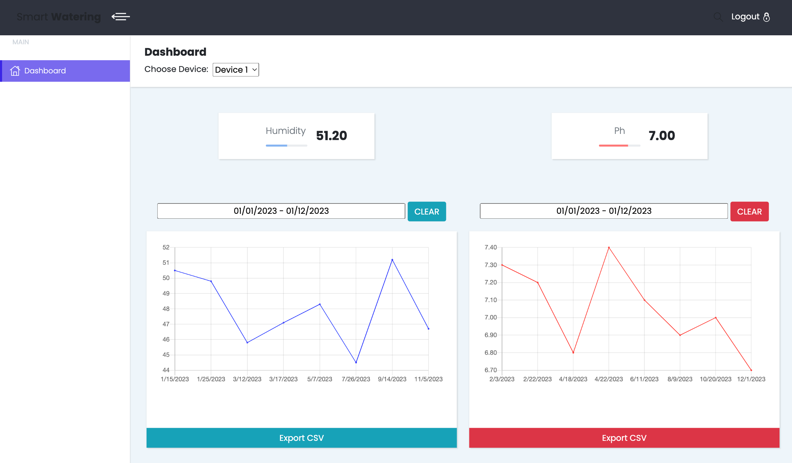

# Smart Watering  - README

## Prerequisites
- Install PHP
- Install XAMPP

### Run project locally

To spin the whole project on your local machine, you'll need to import project into `htdocs` folder and run apache server with MySQL db.

Make sure to import `smart_watering.sql` into previously created `smart_watering` table.

Enjoy!

## Preview
